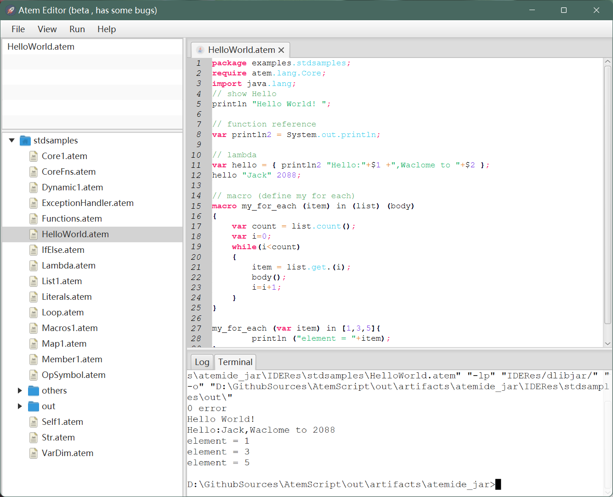

# AtemLang
Atem Programming Language : Dynamic , Light , Functional On JVM . 
You can contact to me with email gongwuyan@outlook.com.

The Release Path is :  out\artifacts\atemide_jar\AtemIDE.jar



---

## HelloWorld

```java  {.line-numbers}
package examples.stdsamples;
require atem.lang.Core;
import java.lang;
// show Hello
println "Hello World! ";

// function reference
var println2 = System.out.println;

// lambda
var hello = { println2 "Hello:"+$1 +",Waclome to "+$2 };
hello "Jack" 2088;

// macro (define my for each)
macro my_for_each (item) in (list) (body)
{
    var count = list.count();
    var i=0;
    while(i<count)
    {
        item = list.get.(i);
        body();
        i=i+1;
    }
}

my_for_each (var item) in [1,3,5]{
        println ("element = "+item);
} ;

```
running output
```
Hello World! 
Hello:Jack,Waclome to 2088
element = 1
element = 3
element = 5
```
## keywords

```java  {.line-numbers}
import require if else package return while true false null function macro var break
```

special identifier

```java  {.line-numbers}
new default self
```
